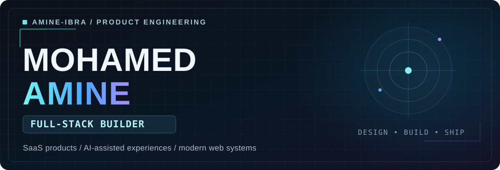
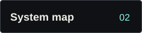
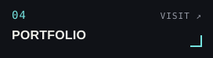
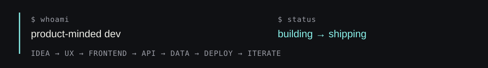
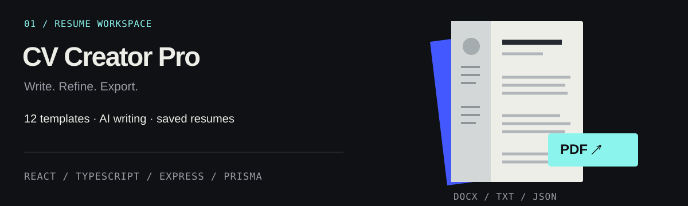
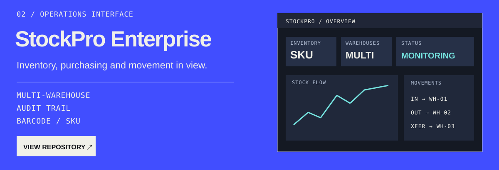
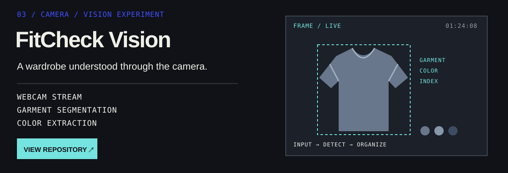
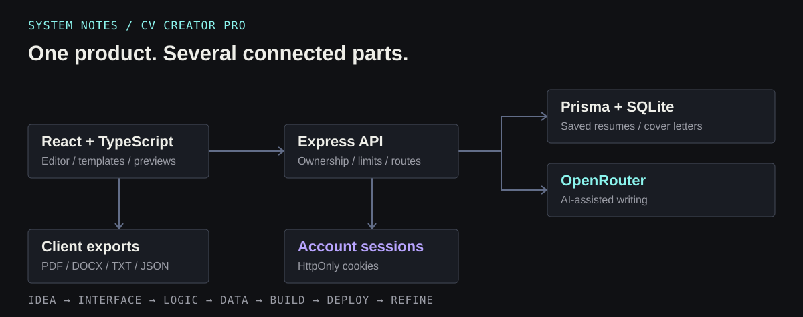
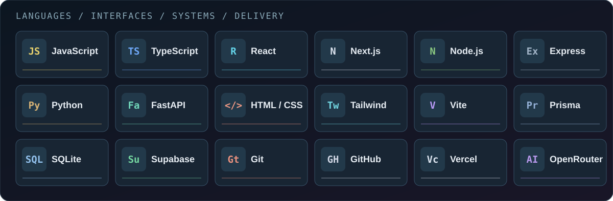

 

 

 

[LinkedIn](https://www.linkedin.com/in/el-ibrahimi-mohamed-amine-630891395/) · [All repositories](https://github.com/AMINE-IBRA?tab=repositories)

## Building end to end

I’m **Mohamed Amine**. I like building the whole product: the interface someone wants to use, the API behind it, the data that lasts, and the details that make the result feel finished. My projects move between SaaS workflows, practical AI, and visual experiments.

## Selected work

**CV Creator Pro** is a React/TypeScript and Express resume workspace with 12 templates, saved resumes and cover letters, account sessions, usage limits, OpenRouter writing tools, and PDF/DOCX/TXT/JSON exports. Prisma and SQLite handle local data. The repository documents the production integrations still to be connected.

**StockPro Enterprise** brings inventory and logistics into one interface: KPIs, multi-warehouse tracking, purchasing, audit trails, barcode/SKU tools, and CSV export. It uses React, Vite, Tailwind CSS, Recharts, and Lucide, with browser storage for persistence.

**FitCheck Vision** is a wardrobe and computer-vision experiment. A JavaScript camera interface streams to a Python/FastAPI backend over WebSockets for garment detection and segmentation, color extraction, wardrobe indexing, and visual overlays.

## How the pieces connect

The shape changes from project to project, but the habit stays the same: **understand the use case, make the interaction clear, connect the systems, ship, then refine**.

## Tools in rotation

**Interfaces:** JavaScript, TypeScript, React, Next.js, HTML/CSS, Tailwind CSS, Vite 
**Systems:** Node.js, Express, Python, FastAPI, Prisma, SQLite, Supabase, OpenRouter 
**Delivery:** Git, GitHub, Vercel

## Smaller builds

[Landing Page Builder](https://github.com/AMINE-IBRA/LANDING-PAGE-BUILDER) · [CV Creator](https://github.com/AMINE-IBRA/CV-CREATOR) · [Login Page by PHP](https://github.com/AMINE-IBRA/LOGIN-PAGE-BY-PHP)

These are experiments and earlier builds. The three projects above are the best starting point for my current work.

## What I’m working toward

Deeper backend design. More complete SaaS products. AI features that earn their place in the workflow. Better engineering decisions with every build.

---

**BUILD THINGS WORTH OPENING TWICE.**

[Portfolio](https://mohamedamineelibrahimi.vercel.app/) · [LinkedIn](https://www.linkedin.com/in/el-ibrahimi-mohamed-amine-630891395/) · [GitHub](https://github.com/AMINE-IBRA?tab=repositories)

